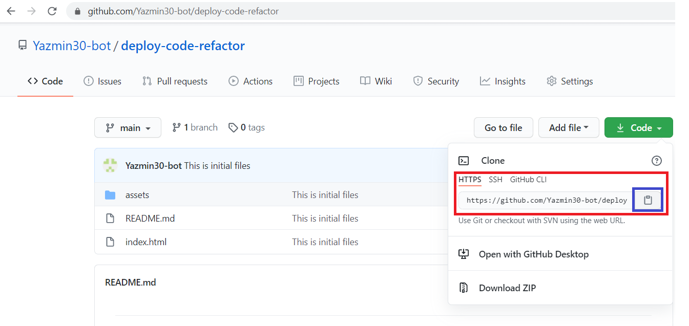

# <Deploy-Code-Refactor>
## Description
It is a common task refactoring an existing code for front-end and junior developers since in the workplace usually work with someone else's code. In this proyect I refactored an existing site to make it more accessible, this is  important because the  accessible sites rank higher in search engines like Google, this helps companies avoid litigation, which might arise if people with disabilities can't access a website.

In order to my own site is optimized for search engines, I improved the codebase that follows accessibility standards such as check links are functioning correctly, consolidating the selectors and properties, organizing them to follow the semantic structure of the HTML elements, and including comments before each element or section of the page.

## Requirements
This proyect  requires no modules outside of the core.

## Installation
1. Go to the following link [https://github.com/Yazmin30-bot/deploy-code-refactor/](https://github.com/Yazmin30-bot/deploy-code-refactor/) and clone the link 

2. Go to Git-bash and page the github's, with the next code

`$ git clone https://github.com/Yazmin30-bot/deploy-code-refactor.git `

