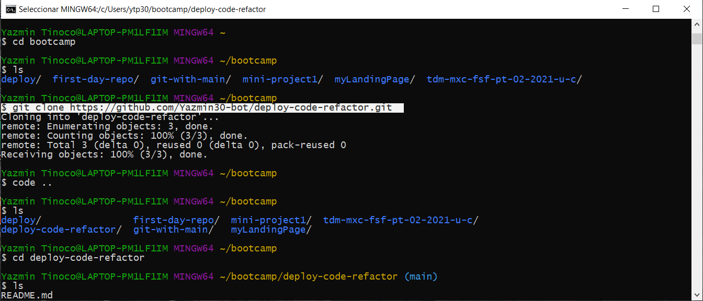

# <Deploy-Code-Refactor>
## Description
It is a common task refactoring an existing code for front-end and junior developers since in the workplace usually work with someone else's code. In this proyect I refactored an existing site to make it more accessible, this is  important because the  accessible sites rank higher in search engines like Google, this helps companies avoid litigation, which might arise if people with disabilities can't access a website.

In order to my own site is optimized for search engines, I improved the codebase that follows accessibility standards such as check links are functioning correctly, consolidating the selectors and properties, organizing them to follow the semantic structure of the HTML elements, and including comments before each element or section of the page.

## Requirements
This proyect  requires no modules outside of the core.

## Installation
Go to the following link and [https://github.com/Yazmin30-bot/deploy-code-refactor/](https://github.com/Yazmin30-bot/deploy-code-refactor/). and clone the link 

Go to Git-bash and clone in your local with the next code

`$ git clone https://github.com/Yazmin30-bot/deploy-code-refactor.git `(this is the github's link)




## Usage
Provide instructions and examples for use. Include screenshots as needed.
To add a screenshot, create an `assets/images` folder in your repository and upload your screenshot to it. Then, using the relative filepath, add it to your README using the following syntax:
    ```md
    
    ```

## License
The last section of a high-quality README file is the license. This lets other developers know what they can and cannot do with your project. If you need help choosing a license, refer to [https://choosealicense.com/](https://choosealicense.com/).
---
🏆 The previous sections are the bare minimum, and your project will ultimately determine the content of this document. You might also want to consider adding the following sections.


